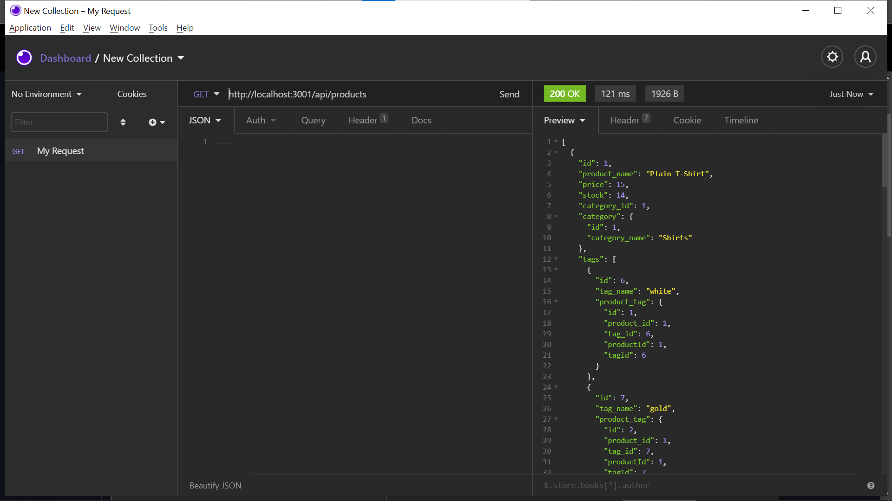
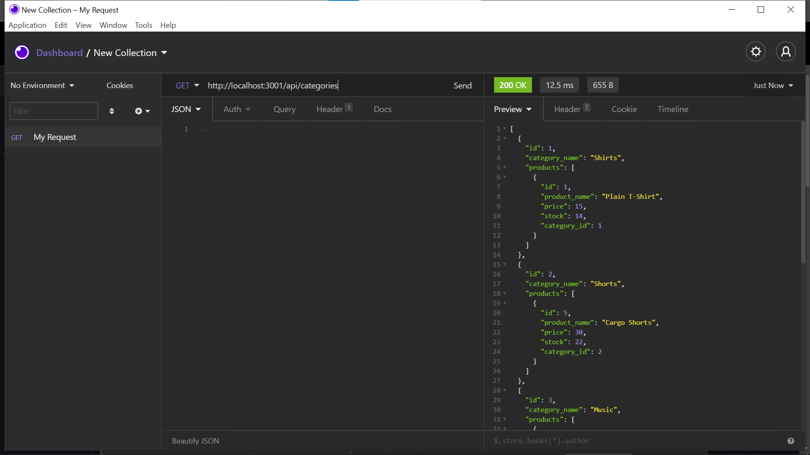
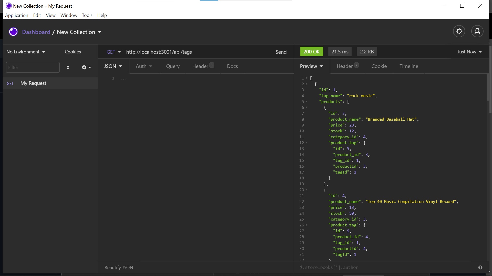

# E-Commerce BackEnd
## Description
This application is comprised of many working parts that all seamlessly come together to build a polished application, that works with a databse to store and update data using CRUD functionality. 

## Table of Contents 
- [Installation](#installation)
- [Deployment](#deployment)
- [Features](#features)
- [Demo](#demo)
- [Contribution](#contribution)
- [License](#license) 

## Installation
To install this repo clone the ssh key. Then you can  start working on this project. A npm inint -y will create your package.json file. The dependencies you will need to install are sequlize, express and dotenv. You will also need to have MySql, MySQL Workbench and Insomnia. From there you can start working on this project.

## Deployment
[Github](https://github.com/Sawyer0/Ecommerce-Backend)

## Features
- CRUD operations
- Node.js
- MySql/Sequelize 

## Demo 
.

## Contribution
This repo welcomes all forks and contributions.

## License

Copyright (c) 2021 Dawan Sawyer

Permission is hereby granted, free of charge, to any person obtaining a copy
of this software and associated documentation files (the "Software"), to deal
in the Software without restriction, including without limitation the rights
to use, copy, modify, merge, publish, distribute, sublicense, and/or sell
copies of the Software, and to permit persons to whom the Software is
furnished to do so, subject to the following conditions:

The above copyright notice and this permission notice shall be included in all
copies or substantial portions of the Software.

THE SOFTWARE IS PROVIDED "AS IS", WITHOUT WARRANTY OF ANY KIND, EXPRESS OR
IMPLIED, INCLUDING BUT NOT LIMITED TO THE WARRANTIES OF MERCHANTABILITY,
FITNESS FOR A PARTICULAR PURPOSE AND NONINFRINGEMENT. IN NO EVENT SHALL THE
AUTHORS OR COPYRIGHT HOLDERS BE LIABLE FOR ANY CLAIM, DAMAGES OR OTHER
LIABILITY, WHETHER IN AN ACTION OF CONTRACT, TORT OR OTHERWISE, ARISING FROM,
OUT OF OR IN CONNECTION WITH THE SOFTWARE OR THE USE OR OTHER DEALINGS IN THE
SOFTWARE.

   
    
   
